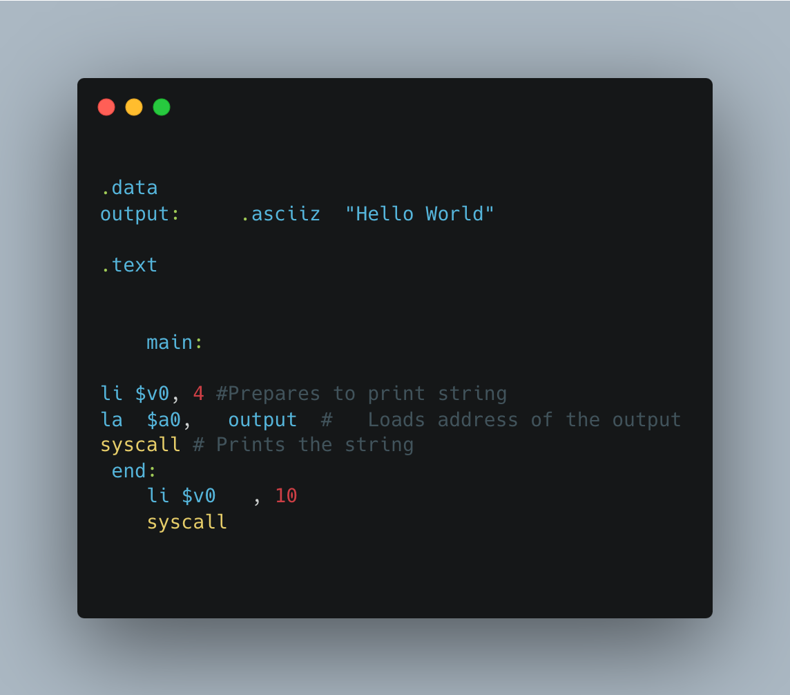
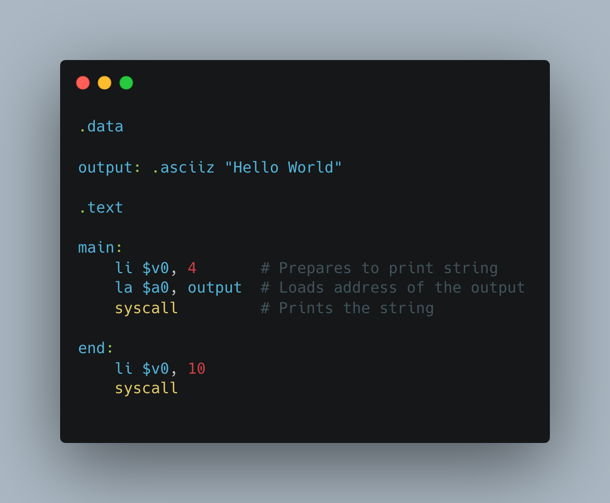

# `mac-mips`: A file formatter for MIPS source files

A simple CLT that formats source files of MIPS assembly code.

- Removes redundant whitespace
- Positions commas correctly
- Aligns comments
- Correctly indents lines after procedures

## Example

|                 Before                  |                 After                 |
| :-------------------------------------: | :-----------------------------------: |
|  |  |
